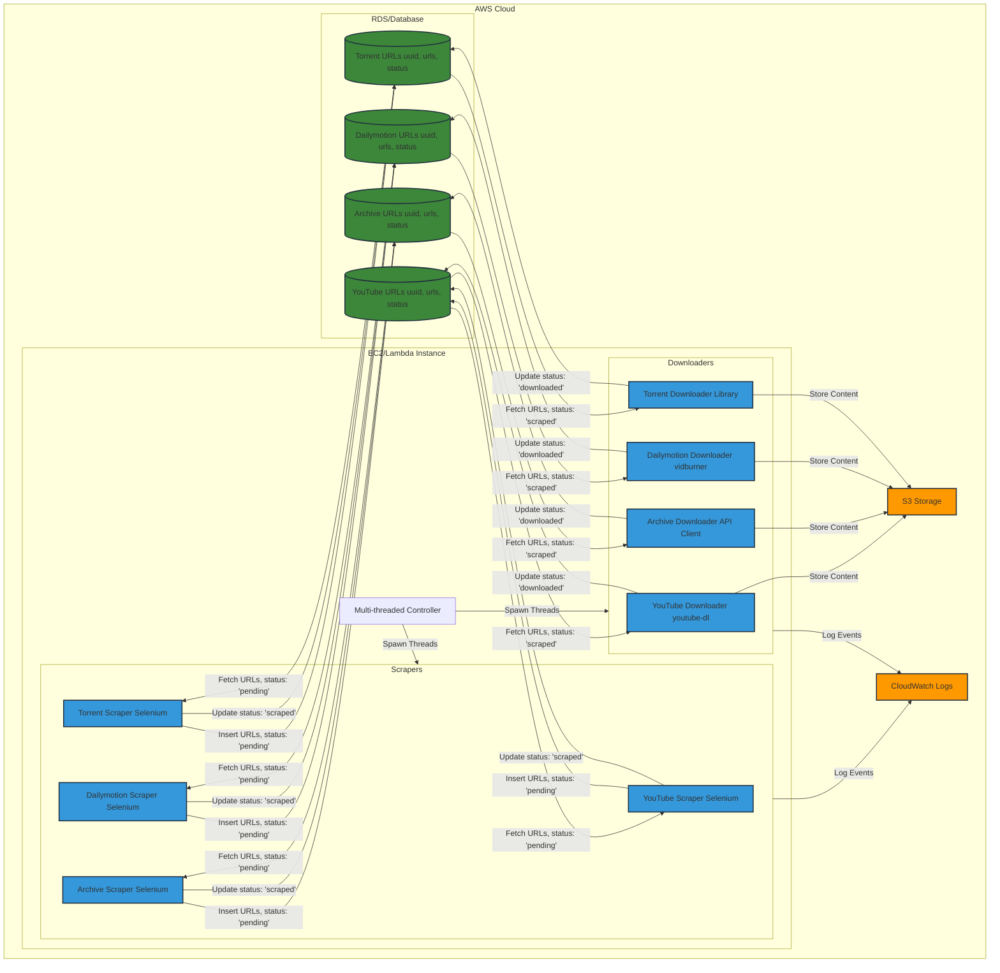

# scrapers

### Here are the things I need scrape

1. Youtube Videos
2. Instagram Reels
3. Archive[dot]org
4. Dailymotion
5. Invideo
6. Vimeo
7. Movies from torrents

### Here's how I plan to do

1. Youtube videos:
There are pretty easy to do I guess, I just need to utilize selenium to get the links to videos and then download them using youtube-dl. Also need to make sure that the videos contains a speaker with his face visible, so here we can utilize videos from TEDx, JRE Podcast, News Channels, Movie Clips, etc.

2. Instagram Reels:
Tricky af, because they block scraping, and may permanently block the IP

3. Archive[dot]org:
I can use selenium to navigate to the website and then download the videos from there, pretty straightforward

4. Dailymotion:
I can use selenium to navigate to the website, then copy the url and then we can navigate to savefrom.net/vidburner.com and then paste the url in the input box and then download the video.

5. Invideo:
Thinking in progress

6. Vimeo:
Same as Dailymotion.
UPDATE: Due to dynamically generated hash in the config url of the video, we can't download it. Still there is a way to download the video, we can use websites like savethevideo.com, vidburner.com, etc. to download the video, but they are very slow and we can't download multiple videos at once, so we need to find a way to download the videos from vimeo.

7. Movies from torrents:
We can use python-qbittorrent library for this, but we'll need to install qBittorrent on the server, enable the web ui for it (so that we can access it on the local host) and then we can use the library to download the torrents, here also we need to determine what types of movies we need to download, like we can download movies from the top 250 list of IMDB, or we can download movies from the top 100 list of Rotten Tomatoes, etc.

UPDATE: There's a library called torrentp, which can be used to download videos from torrents. But we'll still need to get the magnet link of the torrent, we can use sites like 1337x, piratebay, etc. to get the magnet link of the torrent using selenium.

### Difficult part:

We need to make sure that the scraped videos has a speaker with his face visible, so that we can use it for the training of the model.

Here's how I plan on doing it:

1. Use Temporal Segmentation
Split the video into smaller chunks (eg 1 minute or 5 minute clips).

2. Use OpenCV for Face Detection and Tracking
- Detect faces in each segment using OpenCV's face detection modesl.
- Track faces across frame to avoid redudant detections and ensure continuity.

3. Map Faces Presence to Timestamps
- Record the timestamps where the faces are detected.
- Use this information to determine the total duration of the speaker's presence in the video.

4. Extract Relevant Segments
Once identified, extract the segments where the speaker is present.

The above sounds easy to do, but it's not, because the video can have multiple speakers and we need to make sure that each speaker is detected and tracked properly, so that we can use the video for traning the model.

Firstly I need focus on scraping the videos, then I'll move on to the difficult part.

